# Forum

[ [**English**](README.md) | [Ukrainian](README.uk.md) | [Russian](README.ru.md) ]

## Table of Contents

- [Forum](#forum)
  - [Table of Contents](#table-of-contents)
  - [About the Project](#about-the-project)
    - [Project Goals](#project-goals)
    - [Technologies](#technologies)
    - [Project structure](#project-structure)
      - [Client](#client)
      - [Server](#server)
      - [Database](#database)
    - [User roles and permissions](#user-roles-and-permissions)
    - [REST API Endpoints](#rest-api-endpoints)
    - [Examples of the Application (Screenshots)](#examples-of-the-application-screenshots)
  - [Installation](#installation)
    - [Database](#database-1)
    - [Server](#server-1)
    - [Client](#client-1)
  - [Usage](#usage)
    - [Running the Server](#running-the-server)
    - [Client](#client-2)

## About the Project

This project is a full-featured web forum built with a client–server architecture.
The server side is implemented using Node.js + Express + TypeScript following the MVC architecture. The client side is built with React + TypeScript using Redux Toolkit and React Router, organized according to Feature-Sliced Design principles.

The project demonstrates the development of a complete REST API with full client–server communication.

The forum allows users to:

- register and log in

- publish posts, edit them, and add images

- create and browse topics

- subscribe to favorite topics and receive notifications

- search posts, authors, and topics

- report posts that violate the rules

- customize their profile

- moderate the forum using special roles (moderator, admin): ban posts and authors, remove prohibited content

### Project Goals

The main goal of this project is to reinforce practical knowledge of full-stack application development.

The project included the following objectives:

- practice building REST APIs using Node.js + Express

- apply the MVC architecture on the server

- implement authentication and authorization using JWT + Cookies

- practice working with an SQL database (MySQL) via the Sequelize ORM

- organize the client application using Feature-Sliced Design

- use Redux Toolkit for client-side state management

- configure interaction between frontend and backend

- practice TypeScript typing on both the server and client

- design a scalable project structure

This project helped reinforce knowledge of application architecture, code organization, authentication, and scalable web application development.

### Technologies

Client:

- TypeScript
- React (Hooks, Context API, Portal, etc.)
- Redux Toolkit
- React libraries:
  - React Router (Declarative mode)
  - Styled Components (CSS-in-JS)
  - React Hot Toast
  - React Icons
- Validation: Zod
- Architecture: Feature-Sliced Design
- Tools: Vite
- ESLint, Prettier

Server:

- TypeScript
- Node.js
- Express.js
- Sequelize ORM
- JSON Web Token + Cookie
- Validation: Zod
- Architecture: MVC
- Tools: Vite
- ESLint, Prettier

Database:

- MySQL + MySQL Workbench

### Project structure

#### Client

```
└───client
    ├───public/...
    ├───src
    │   ├───app
    │   │   ├───providers/...
    │   │   ├───routes/...
    │   │   ├───store/...
    │   │   └───styles/...
    │   ├───entities
    │   │   ├───author/...
    │   │   ├───category/...
    │   │   ├───forum/...
    │   │   ├───post/...
    │   │   ├───report/...
    │   │   ├───statistic/...
    │   │   ├───thread/...
    │   │   └───user/...
    │   ├───features
    │   │   ├───banPost/...
    │   │   ├───banUser/...
    │   │   ├───changeAvatar/...
    │   │   ├───changePassword/...
    │   │   ├───createCategory/...
    │   │   ├───createForum/...
    │   │   ├───createThread/...
    │   │   ├───deleteAccount/...
    │   │   ├───deleteCategory/...
    │   │   ├───deleteForum/...
    │   │   ├───deletePost/...
    │   │   ├───deleteThread/...
    │   │   ├───likePost/...
    │   │   ├───rejectReport
    │   │   ├───reportPost/...
    │   │   ├───search/...
    │   │   ├───showNotifications/...
    │   │   ├───signin/...
    │   │   ├───signout/...
    │   │   ├───signup/...
    │   │   ├───sortThreads/...
    │   │   ├───subscribeThread/...
    │   │   ├───toggleTheme/...
    │   │   ├───updateBio/...
    │   │   ├───updateCategoryTitle/...
    │   │   ├───updateForumTitle/...
    │   │   ├───updatePost/...
    │   │   └───updateThreadTitle/...
    │   ├───pages
    │   │   ├───account
    │   │   │   ├───bio/...
    │   │   │   ├───notifications/...
    │   │   │   ├───posts/...
    │   │   │   ├───reports/...
    │   │   │   ├───settings/...
    │   │   │   ├───subscriptions/...
    │   │   │   └───threads/...
    │   │   ├───auth
    │   │   │   ├───signin/...
    │   │   │   └───signup/...
    │   │   ├───author
    │   │   │   └───profile/...
    │   │   ├───forum/...
    │   │   ├───home/...
    │   │   ├───pageNotFound/...
    │   │   └───thread
    │   │       ├───thread/...
    │   │       └───threadCreate/...
    │   ├───shared
    │   │   ├───assets/...
    │   │   ├───layouts
    │   │   │   ├───AccountLayout/...
    │   │   │   └───AppLayout/...
    │   │   ├───lib
    │   │   │   ├───context/...
    │   │   │   ├───hooks/...
    │   │   │   ├───utils/...
    │   │   │   └───validators/...
    │   │   ├───types/...
    │   │   └───ui
    │   │       ├───Dropdown/...
    │   │       ├───Form/...
    │   │       ├───InlineModal/...
    │   │       ├───Modal/...
    │   │       └───WidgetKit/...
    │   ├───widgets
    │   │   ├───AccountBioWidget/...
    │   │   ├───AccountDeleteWidget/...
    │   │   ├───AccountNavBarWidget/...
    │   │   ├───AccountNotificationsWidget/...
    │   │   ├───AccountPasswordWidget/...
    │   │   ├───AccountPostsWidget/...
    │   │   ├───AccountReportsWidget/...
    │   │   ├───AccountSubscriptionsWidget/...
    │   │   ├───AccountThreadsWidget/...
    │   │   ├───AuthorProfileWidget/...
    │   │   ├───CategoriesWidget/...
    │   │   ├───ForumWidget/...
    │   │   ├───LatestPostsWidget/...
    │   │   ├───NavBarWidget/...
    │   │   ├───StatisticWidget/...
    │   │   └───ThreadWidget/...
    │   └───main.tsx
    └───index.html
```

#### Server

```
└───server
    ├───public
    │   └───images
    │       ├───avatars/...
    │       └───posts/...
    ├───src
    │   ├───config/...
    │   ├───constants/...
    │   ├───controllers/...
    │   ├───middleware/...
    │   ├───models/...
    │   ├───routes/...
    │   ├───types/...
    │   ├───utils/...
    │   └───validators/...
    ├───app.ts
    └───server.ts
```

#### Database

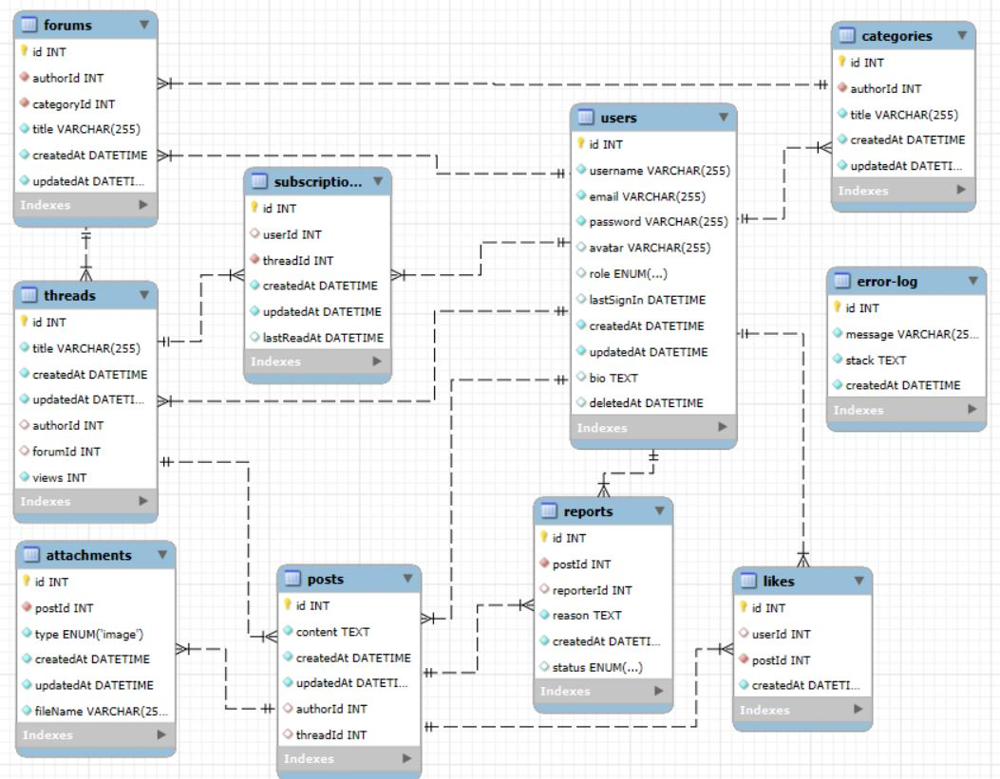

### User roles and permissions

|                              | Guest | User | Moderator | Admin |
| ---------------------------- | :---: | :--: | :-------: | :---: |
| View posts                   |  ✅   |  ✅  |    ✅     |  ✅   |
| View topics                  |  ✅   |  ✅  |    ✅     |  ✅   |
| View forums                  |  ✅   |  ✅  |    ✅     |  ✅   |
| View categories              |  ✅   |  ✅  |    ✅     |  ✅   |
| View profiles                |  ✅   |  ✅  |    ✅     |  ✅   |
| View statistics              |  ✅   |  ✅  |    ✅     |  ✅   |
| Create a post                |  ❌   |  ✅  |    ✅     |  ✅   |
| Create a topic               |  ❌   |  ✅  |    ✅     |  ✅   |
| Create a forum               |  ❌   |  ❌  |    ✅     |  ✅   |
| Create a category            |  ❌   |  ❌  |    ✅     |  ✅   |
| Edit **own** post            |  ❌   |  ✅  |    ✅     |  ✅   |
| Edit topic                   |  ❌   |  ❌  |    ✅     |  ✅   |
| Edit forum                   |  ❌   |  ❌  |    ✅     |  ✅   |
| Edit category                |  ❌   |  ❌  |    ✅     |  ✅   |
| Delete post                  |  ❌   |  ❌  |    ✅     |  ✅   |
| Delete topic                 |  ❌   |  ❌  |    ❌     |  ✅   |
| Delete "empty" forum         |  ❌   |  ❌  |    ❌     |  ✅   |
| Delete "empty" category      |  ❌   |  ❌  |    ❌     |  ✅   |
| Delete **own** account       |  ❌   |  ✅  |    ❌     |  ❌   |
| Subscribe to a topic         |  ❌   |  ✅  |    ✅     |  ✅   |
| Like someone else's post     |  ❌   |  ✅  |    ✅     |  ✅   |
| Report a post                |  ❌   |  ✅  |    ❌     |  ❌   |
| Reject a report              |  ❌   |  ❌  |    ✅     |  ✅   |
| Ban a post based on a report |  ❌   |  ❌  |    ✅     |  ✅   |
| Ban a user based on a report |  ❌   |  ❌  |    ✅     |  ✅   |

### REST API Endpoints

> [!TIP]
> Abbreviation for roles:
>
> - U = user
> - M = moderator
> - A = admin

| Method | URL                                   | Authorized | Roles | Comment                               |
| :----: | :------------------------------------ | :--------: | :---: | :------------------------------------ |
|  GET   | /api/v1/auth/me                       |     ✅     | U М А |                                       |
|  POST  | /api/v1/auth/signin                   |     ❌     |   -   |                                       |
|  POST  | /api/v1/auth/signup                   |     ❌     |   -   |                                       |
|  POST  | /api/v1/auth/signout                  |     ✅     | U М А |                                       |
|  GET   | /api/v1/users/:userId/posts           |     ❌     |   -   |                                       |
|  GET   | /api/v1/users/:userId/threads         |     ❌     |   -   |                                       |
|  GET   | /api/v1/users/subscriptions           |     ✅     | U М А | **Personal** subscriptions            |
|  GET   | /api/v1/users/notifications           |     ✅     | U М А | **Personal** notifications            |
| PATCH  | /api/v1/users/bio                     |     ✅     | U М А | Updating **your** biography           |
| PATCH  | /api/v1/users/password                |     ✅     | U М А | Change **your** password              |
| PATCH  | /api/v1/users/avatar                  |     ✅     | U М А | Changing **your** avatar              |
| DELETE | /api/v1/users                         |     ✅     |   U   | Deleting **your** account             |
|  GET   | /api/v1/authors/:authorId/profile     |     ❌     |   -   |                                       |
|  GET   | /api/v1/authors/search                |     ❌     |   -   |                                       |
|  GET   | /api/v1/posts/latest                  |     ❌     |   -   |                                       |
|  GET   | /api/v1/posts/search                  |     ❌     |   -   |                                       |
|  POST  | /api/v1/posts                         |     ✅     | U М А |                                       |
|  POST  | /api/v1/posts/:postId/like            |     ✅     | U М А | Like a post by **another** author     |
|  POST  | /api/v1/posts/:postId/report          |     ✅     |   U   | Report a post by **another** author   |
| DELETE | /api/v1/posts/:postId                 |     ✅     |  М А  |                                       |
| DELETE | /api/v1/attachments/:attachmentId     |     ✅     | U М А | Removing attachments in **your** post |
|  GET   | /api/v1/threads/search                |     ❌     |   -   |                                       |
|  GET   | /api/v1/threads/:threadId             |     ❌     |   -   |                                       |
|  POST  | /api/v1/threads                       |     ✅     | U М А |                                       |
|  POST  | /api/v1/threads/:threadId/subscribe   |     ✅     | U М А |                                       |
|  POST  | /api/v1/threads/:threadId/unsubscribe |     ✅     | U М А |                                       |
| PATCH  | /api/v1/threads/:threadId             |     ✅     |  М А  |                                       |
| DELETE | /api/v1/threads/:threadId             |     ✅     |   А   |                                       |
|  GET   | /api/v1/forums/:forumId               |     ❌     |   -   |                                       |
|  POST  | /api/v1/forums                        |     ✅     |  М А  |                                       |
| PATCH  | /api/v1/forums/:forumId               |     ✅     |  М А  |                                       |
| DELETE | /api/v1/forums/:forumId               |     ✅     |   А   |                                       |
|  GET   | /api/v1/categories                    |     ❌     |   -   |                                       |
|  POST  | /api/v1/categories                    |     ✅     |  М А  |                                       |
| PATCH  | /api/v1/categories/:categoryId        |     ✅     |  М А  |                                       |
| DELETE | /api/v1/categories/:categoryId        |     ✅     |   А   |                                       |
|  GET   | /api/v1/reports                       |     ✅     |  М А  |                                       |
|  POST  | /api/v1/reports/:reportId/reject      |     ✅     |  М А  |                                       |
|  POST  | /api/v1/reports/:reportId/ban/post    |     ✅     |  М А  |                                       |
|  POST  | /api/v1/reports/:reportId/ban/user    |     ✅     |  М А  |                                       |
|  GET   | /api/v1/statistic                     |     ❌     |   -   |                                       |

### Examples of the Application (Screenshots)

Demonstration of responsive design with light and dark theme switching:

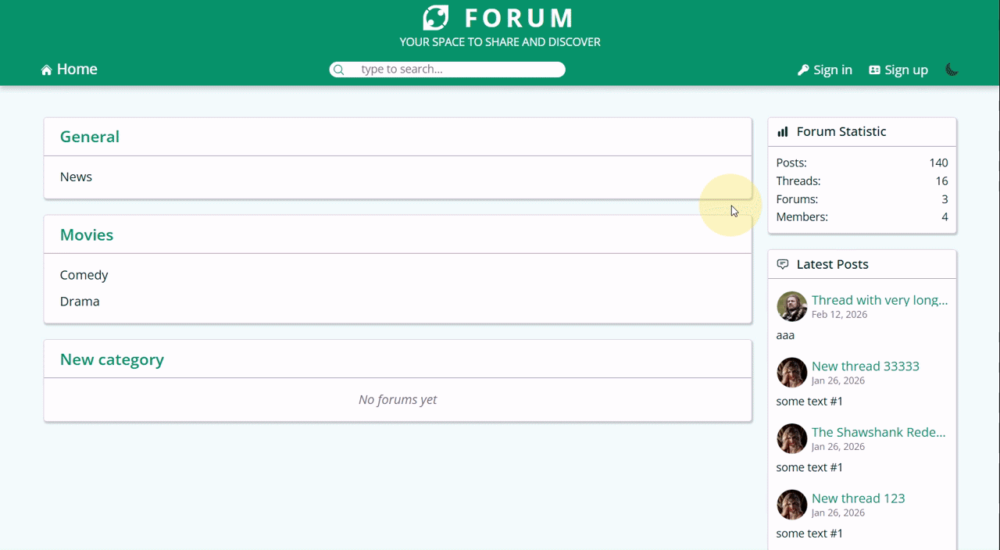


User registration with client-side and server-side validation:

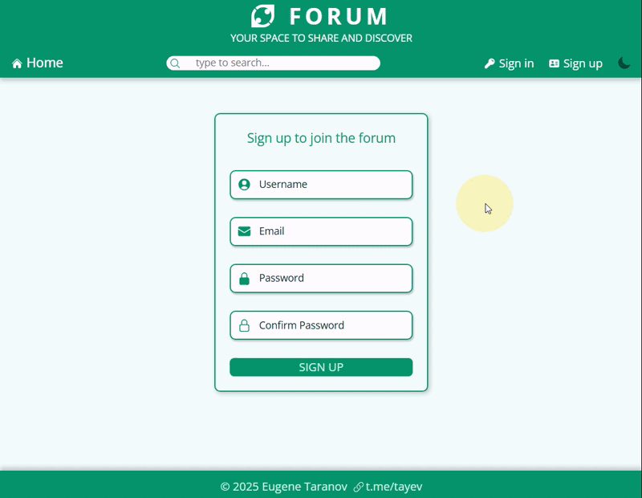

Updating avatar and biography in the account:

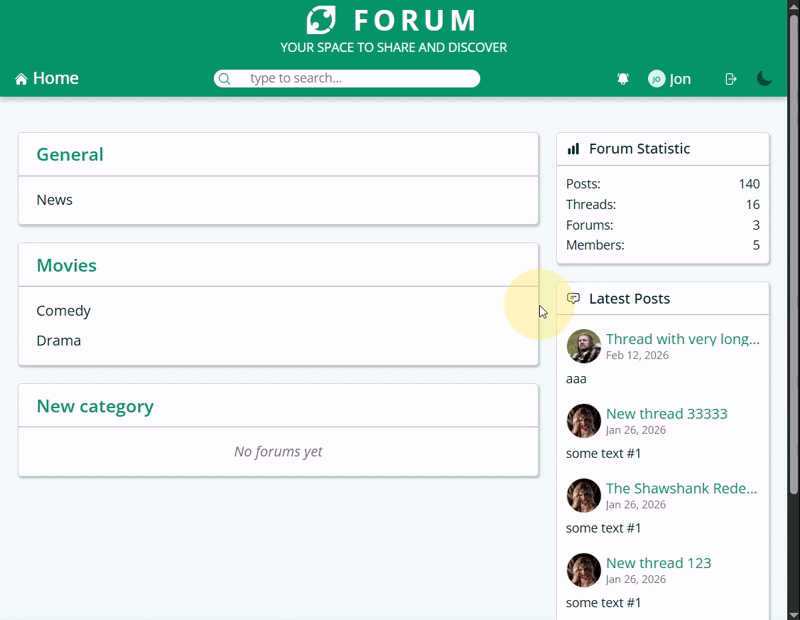

Creating a new topic and the first post with attached images:

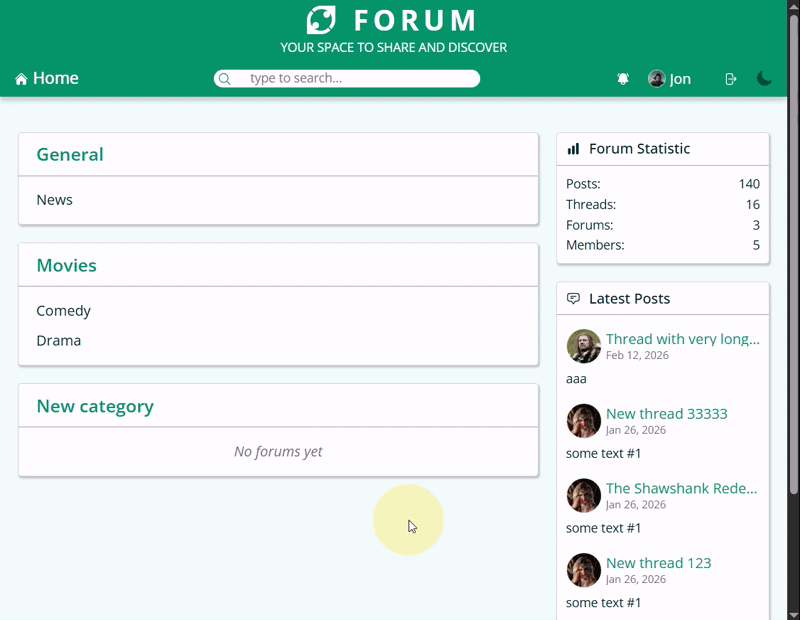

Editing a post - changing the text, selectively removing attached images, and adding new ones:

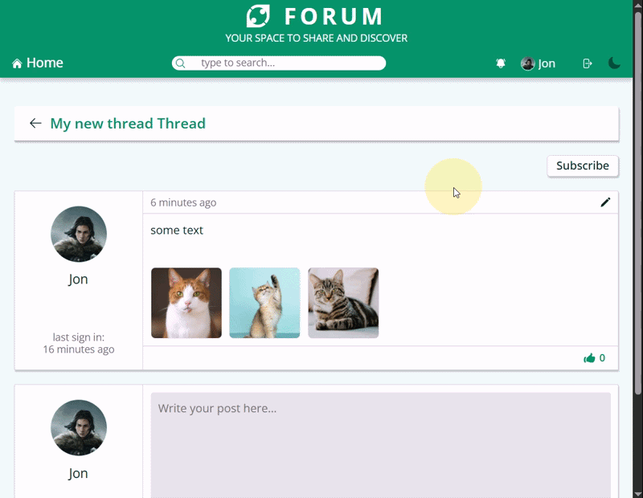

Liking posts and subscribing to a topic:

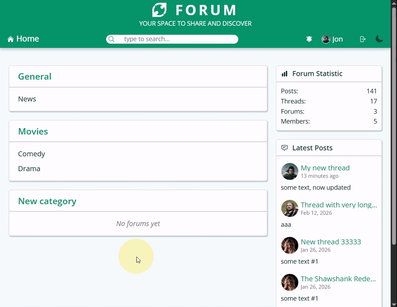

A user receives a notification when a new post appears in a subscribed topic. Notifications are displayed in the panel and on the account page. When a notification is clicked, the topic page opens at the first unread post and the page scrolls to it:

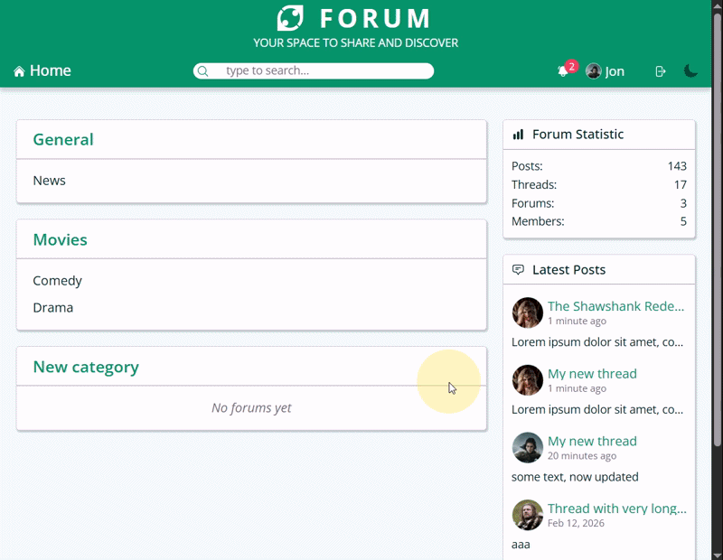

Example of reporting posts:

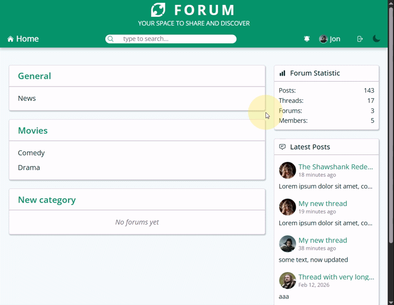

An administrator (or moderator) reviews reports and can reject them, ban the post, or ban the user. The report displays information about the reason, time, reporter, and the post itself:

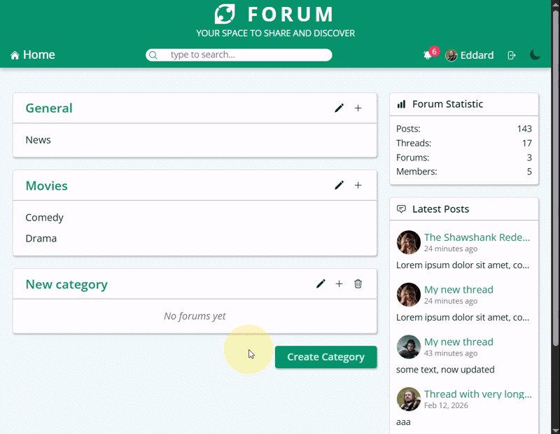

Search is available across all posts, topics, and authors:

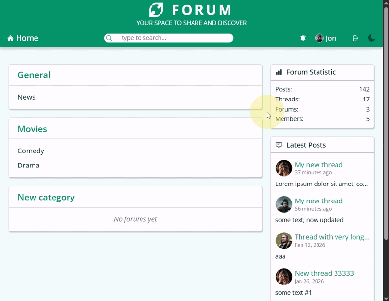

An administrator can create and edit categories and forums, and delete empty ones:

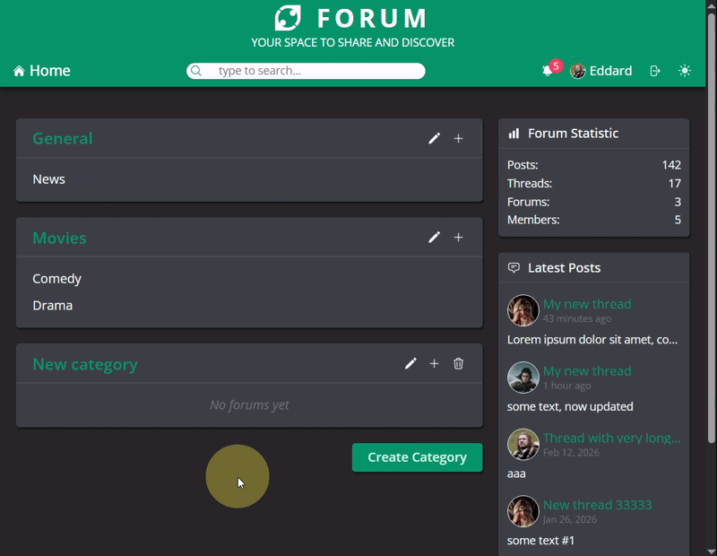

## Installation

### Database

> [!NOTE]
> To work with MySQL, you need to install MySQL Server and MySQL Workbench.

> [!NOTE]
> Leave the server address as the default `localhost:3306`, with the connection `User: root` and `Password: 1111`.
>
> If the address/port or User/Password are different, you need to update the `.env` file on the server with the corresponding fields.

To import the database schema and data:

1. In MySQL Workbench, create a connection with `User: root` and `Password: 1111`
2. Open `Server` -> `Data Import`
3. Select `Import from Self-Contained File`
4. Choose the file `/db-backup/forum-db-backup.sql`
5. In the `Default Target Schema` section click `New…` and create a new schema named `forum`
6. Then select `Import Progress` and click `Start Import`

### Server

Go to the `server` folder from the project root:

```
cd server
```

Install dependencies:

```
npm i
```

### Client

Go to the `client` folder from the project root:

```
cd client
```

Install dependencies:

```
npm i
```

## Usage

### Running the Server

Go to the `server` folder from the project root and start the server:

```
npm run dev
```

> [!TIP]
> The default server address is `localhost:3000`

### Client

Go to the `client` folder from the project root and run:

```
npm run dev
```

> [!TIP]
> By default, the application can be opened in the browser at `localhost:5173`
